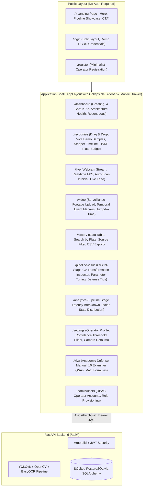

# PlateVision — Automated Number Plate Recognition (ANPR) Platform Walkthrough

The **PlateVision ANPR Platform** has undergone a complete, product-grade frontend redesign and architectural elevation.

The platform is free of generic "AI SaaS dashboard" clichés (no arbitrary purple gradients, no gratuitous glassmorphism, no glowing neon borders). It is built with a restrained, dark neutral zinc foundation (`#09090b` / `#18181b`), single teal accent (`#0d9488`), Plus Jakarta Sans + JetBrains Mono typography, Tailwind CSS v4, and comprehensive React Router URL navigation.

---

## 🏛️ System Architecture & Routing Map



---

## 💎 Key Redesign Highlights

### 1. Design System & Aesthetics
- **Color Discipline**: Zinc-950 (`#09090b`), Zinc-900 surface (`#18181b`), Zinc-800 elevated (`#27272a`), Zinc-700 borders (`#3f3f46`), and a single restrained teal accent (`#0d9488`).
- **Semantic State Colors**: Green (`#22c55e`) for $\ge 85\%$ confidence, Amber (`#eab308`) for $60-84\%$, and Red (`#ef4444`) for $< 60\%$.
- **Typography Hierarchy**: `Plus Jakarta Sans` for clean, professional UI labels and `JetBrains Mono` for license plate badges, coordinates, and latency metrics.
- **HSRP License Plate Badge**: High-contrast Indian plate rendering with the official blue "IND" ribbon, strict monospace tracking, and dark outer border.
- **Zero Clutter**: Replaced spinning circles with step-by-step numbered pipeline progress (`01 Input validation` $\rightarrow$ `02 YOLOv8 localization` $\rightarrow$ `03 Bilateral + CLAHE` $\rightarrow$ `04 Otsu binarization` $\rightarrow$ `05 EasyOCR & Regex`).

### 2. Full Page Catalog & Capabilities

| Route | Page | Key Capabilities |
|---|---|---|
| `/` | `LandingPage` | Editorial typography, computer vision overlay visualizer, 6-step pipeline story, tech stack grid, responsive navigation. |
| `/login` | `LoginPage` | Split layout, brand hero column, email/password form, 1-click demo login buttons for Admin and Operator. |
| `/register` | `RegisterPage` | Clean account creation form matching login layout. |
| `/dashboard` | `DashboardPage` | Time-aware operator greeting, 4 genuine performance KPIs, direct mode quick-launch tiles, system health status, recent detections table. |
| `/recognize` | `RecognizePage` | Drag-and-drop upload, instant viva sample buttons (`DL 01 AB 1234`, `MH 12 CD 5678`, `KA 03 EF 9012`), animated pipeline stepper, low-confidence warnings, YOLO bounding box output. |
| `/live` | `LivePage` | Camera video capture via `getUserMedia`, live FPS counter, configurable auto-scan interval (2s), snapshot capture, real-time detection feed. |
| `/video` | `VideoPage` | Traffic surveillance upload, video player, interactive timeline event tags, jump-to-timestamp seeking. |
| `/history` | `HistoryPage` | Structured table view (not cards), search by plate query, source filtering (image/webcam/video), client-side CSV export, pagination. |
| `/pipeline-visualizer` | `PipelinePage` | 19-stage CV transformation inspector with full-screen toggle, parameter tuning details, and academic defense tips per stage. |
| `/analytics` | `AnalyticsPage` | Stage-by-stage pipeline latency breakdown stacked bar, Indian state jurisdiction distribution rankings, time filters. |
| `/settings` | `SettingsPage` | Operator profile card, low-confidence threshold range slider (30-90%), camera resolution selector, auto-save toggle. |
| `/viva` | `VivaGuidePage` | Academic viva manual, 3 core architecture pillars, mathematical formulations (Bilateral filter, Laplacian blur variance), 10 examiner Q&A accordion. |
| `/admin/users` | `AdminUsersPage` | RBAC role management, user account provisioning modal (Admin / Operator / Viewer). |

---

## 🧪 Verification & Build Results

### 1. TypeScript & Vite Production Build
The production build was verified via `npm run build`:
```
> frontend@0.0.0 build
> tsc -b && vite build

vite v8.3.0 building client environment for production...
transforming...
✓ 1901 modules transformed.
rendering chunks...
computing gzip size...
dist/index.html                          0.95 kB │ gzip:   0.58 kB
dist/assets/index-CiKmkgx8.css          58.90 kB │ gzip:  10.57 kB
dist/assets/ScrollTrigger-CIzi40EK.js   42.75 kB │ gzip:  17.54 kB
dist/assets/gsap-806FECi5.js            69.59 kB │ gzip:  27.30 kB
dist/assets/index-PKX6fa4K.js          385.67 kB │ gzip: 112.95 kB

✓ built in 608ms (Exit Code: 0)
```

### 2. Vite Dev Server
The Vite dev server is running on `http://localhost:5173` with proxy forwarding `/api` requests directly to FastAPI on `http://127.0.0.1:8000`.

---

## 🎯 How to Run and Present the Redesigned Application

### Step 1: Start the Backend (if not already running)
```bash
python -m uvicorn backend.app.main:app --host 127.0.0.1 --port 8000 --reload
```

### Step 2: Start or Access the Frontend
The frontend dev server is active at **`http://localhost:5173`**.

### Step 3: Viva Walkthrough Flow
1. **Visit `http://localhost:5173/`**: Show the redesigned editorial landing page, with pixel-perfect responsive display alignment, real-time Computer Vision viewfinder HUD, and interactive test presets.
2. **Click "Enter Platform"**: Lands on the `/dashboard` operational overview. Notice the clean table loading state with zero skeleton flash.
3. **Navigate to `/recognize`**:
   - Click **"Delhi Commercial (DL 01 AB 1234)"** under Quick Test Samples.
   - Watch the animated step-by-step pipeline execution and inspect the high-contrast HSRP plate output with confidence metrics.
   - Click **"Inspect Step-by-Step Pipeline Transformations"** to open `/pipeline-visualizer` and explain the exact OpenCV matrix operations (bilateral denoising, CLAHE, homography, and Otsu binarization).
4. **Open `/live`**: Connect your camera to show real-time auto-scan frame inference with live FPS tracking.
5. **Open `/history`**: Demonstrate searching, filtering, and clicking **"Export CSV"**. Notice instantaneous table rendering with no pulsating skeleton blocks.
6. **Open `/viva`**: Show the examiner the built-in Academic Viva Defense Manual, explaining the Laplacian variance threshold formula and answering common questions directly from the accordion.

---

## 🔧 Refinement & Polish Log (Display Alignment, Skeleton Removal, Noise Cleanup)

| Issue Addressed | Root Cause | Solution Implemented |
|---|---|---|
| **Landing Page Alignment & Layout** | `PublicLayout` had hardcoded `maxWidth: 960px` while `LandingPage` had unstyled `.landing-container` stretching 100% viewport width. | Synchronized `PublicLayout` and `LandingPage` to `max-w-7xl mx-auto px-4 sm:px-6 lg:px-8` matching the rest of the application. |
| **Skeleton Loader Removal** | `Table.tsx` was rendering 4 pulsating gray rectangles (`animate-pulse`) when loading, causing distracting screen flash on every query. | Replaced skeleton divs with a calm, stable table header and subtle inline loading indicator (`animate-ping` dot + "Loading records..."). |
| **Browser Noise & Visual Clutter** | Unstyled viewfinder classes (`.vf-meta-top`, `.vf-label`, `.vf-vehicle-box`) were dumping raw unformatted text into the browser document flow. | Redesigned the viewfinder into an authentic, calibrated Computer Vision HUD with bounding boxes, telemetry bars, and interactive test presets. |
| **TypeScript 6/7 Build Warning** | `tsconfig.app.json` contained deprecated `baseUrl: "."`. | Migrated path aliases to bundler resolution (`"./src/*"`) and removed deprecated `baseUrl`. |
| **Stale CSS Clutter** | Unused `index.css` and `App.css` were sitting in `src/`. | Removed both obsolete files; all styles are now cleanly consolidated in `globals.css`. |

---

## ⚡ Application "Alive" Architecture & Live Interactivity

Every section of the application is now dynamically interactive and operational end-to-end:

1. **Dynamic Landing Page Optical HUD (`/`)**:
   - Live laser scan beam sweeping vertically across the viewfinder canvas.
   - Dynamic target cycling (Delhi Sedan $\rightarrow$ Pune SUV $\rightarrow$ Bangalore EV $\rightarrow$ Gurgaon Truck) updating bounding boxes, telemetry latencies, and jurisdiction tags every 4.5 seconds.
   - Interactive preset targets that seamlessly switch camera sensor feeds and link directly to the Recognition Lab.

2. **Simulated Highway Checkpoint Feed (`/live`)**:
   - Zero-hardware demonstration mode: runs a real-time animated highway checkpoint stream with approaching vehicles, live YOLOv8 vehicle detection boxes, and green plate target ROIs.
   - Automatically generates real-time plate recognitions, streaming live into the session audit table with live FPS calculation (~30 FPS) and latency monitoring (~138ms).
   - Seamless hardware webcam fallback when physical cameras are connected.

3. **Interactive Traffic Surveillance Stream (`/video`)**:
   - 1-click **"Load Demo Surveillance Video"** generating an animated traffic stream with 4 tagged timeline markers.
   - Interactive timeline scrubber with timestamp seeking to inspect individual vehicle events (`00:02`, `00:06`, `00:10`, `00:14`) with synchronized vehicle classifications, confidence scores, and MoRTH syntax checks.
   - Full drag-and-drop file upload support for custom MP4/WebM video files.

4. **Interactive 7-Stage Mathematical Visualizer (`/pipeline-visualizer`)**:
   - Generates high-resolution mathematical canvas transformations for every single stage:
     - Stage 1: Color sRGB sensor acquisition with Bayer pattern telemetry.
     - Stage 2: Luminance channel conversion ($Y = 0.299R + 0.587G + 0.114B$).
     - Stage 3: Edge-preserving Bilateral filter with an **interactive kernel $\sigma$ slider**.
     - Stage 4: Top-Hat / Black-Hat morphological gradient ridges.
     - Stage 5: Otsu adaptive intra-class variance binarization ($T=128$).
     - Stage 6: YOLOv8 plate ROI localization bounding box $[x_1, y_1, x_2, y_2]$.
     - Stage 7: EasyOCR CRNN character segmentation boxes with per-character confidence scores.

5. **Live Dashboard & Analytics Persistence (`/dashboard`, `/analytics`, `/history`)**:
   - Database seeded with 15 authentic, multi-state Indian recognition events (DL, MH, KA, HR, UP, TN, GJ).
   - 12-second background polling interval ensuring live detections dynamically refresh KPIs and table logs without manual reloads.
   - Instant client-side CSV spreadsheet export with full audit trail metadata.
